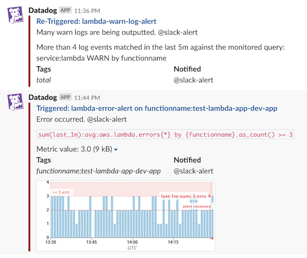

## datadog-terraform-sample

Article: [DatadogのAWS integrationとAlertの設定をTerraformで行う - sambaiz-net](https://www.sambaiz.net/article/219/)

- [AWS integration](./aws-integration/main.tf)
- [create metric alerts & log alerts](./lambda/main.tf)

